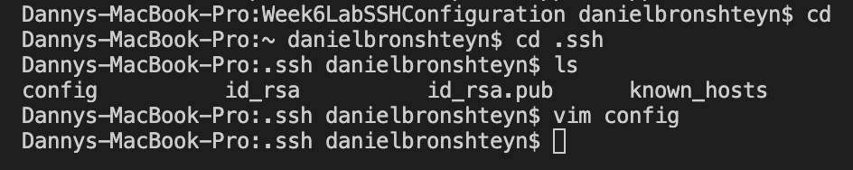
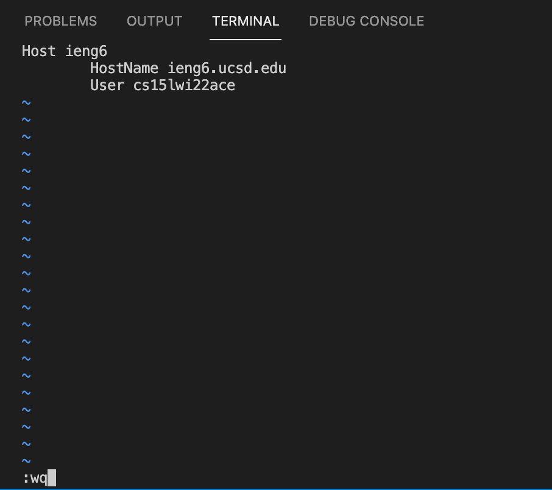
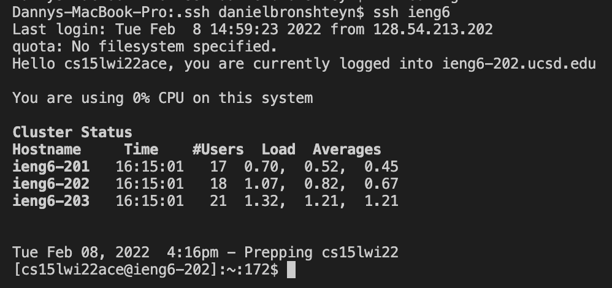
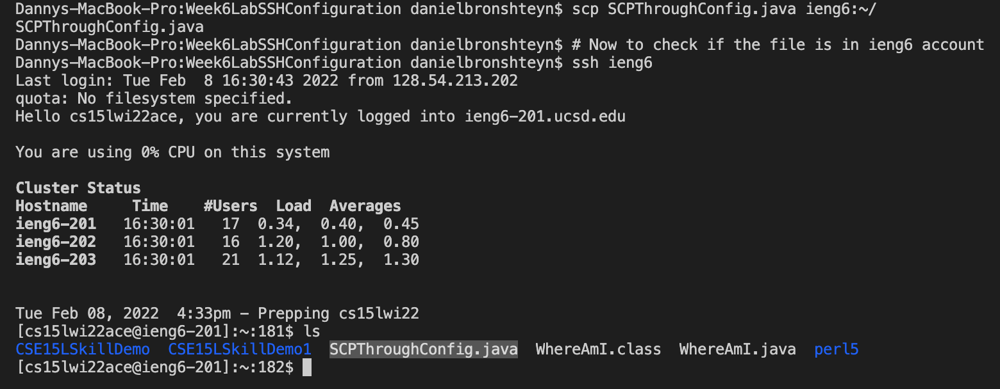

# Week 6 Lab Report 
**Daniel Bronshteyn**
**PID: A16882179**

*Tutors Lindsey and Yukati helped me understand how to create and setup `.ssh/config` on my local computer.*

## *Streamlining `ssh` configuration*

- ### **Creating and editing `.ssh/config` file:**

    

    I created and edited `.ssh/config` file through Visual Studio Code. The command `vim ~/.ssh/config` created the file "config" in the ".ssh" folder of my computer.

    

    To get to the "config" file, I changed directory (`cd`) to .ssh and entered the command `vim config` so that I could edit the text in config. 

    

    At first, the config file was empty. I edited it by adding the Host ieng6, HostName ieng6.ucsd.edu, and for User, my ieng6 account: cs15lwi22ace. I saved and exited the file through the command `:wq`.

    ---

- ### **`ssh` command logging me into account:**

    

    Logging into my ieng6 by using the alias I chose: `ieng6`.

    ---

- ### **`scp` command copying file to ieng6 account:**

    

    I copied the file `SCPThroughConfig.java` to my ieng6 account with the new alias through the command `scp SCPThroughConfig.java ieng6:~/`. I then logged into my account through the alias to ensure that the file was in my ieng6 account.

