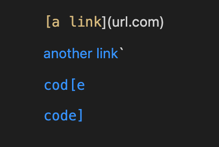
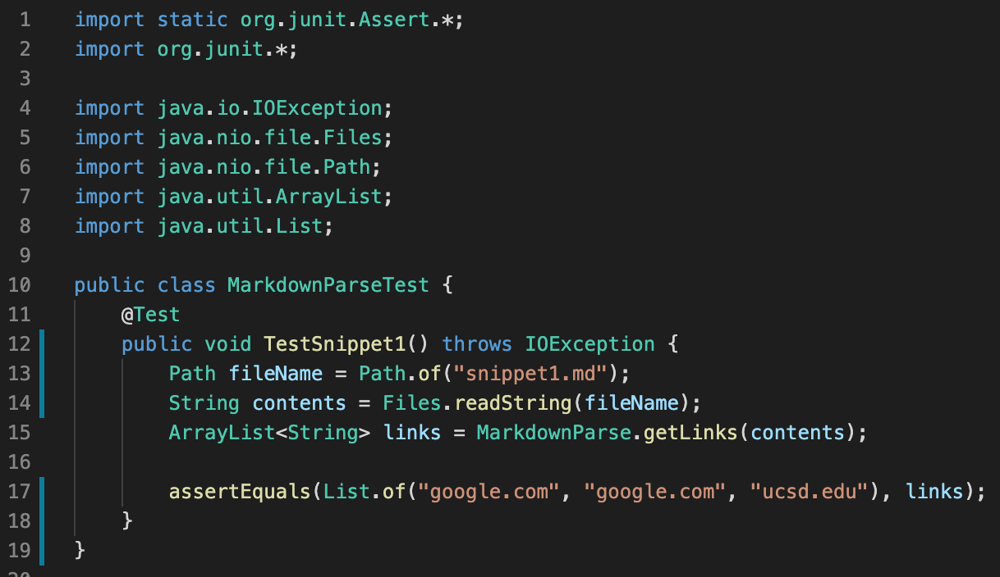
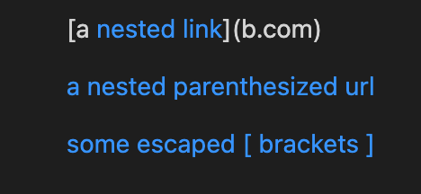
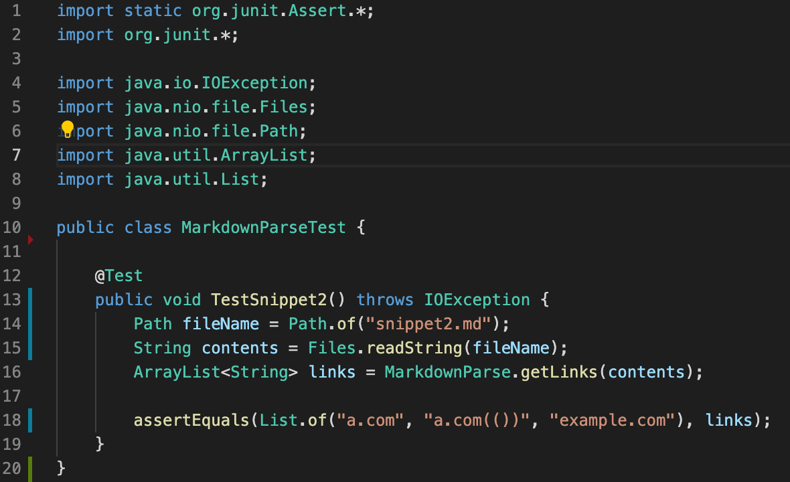
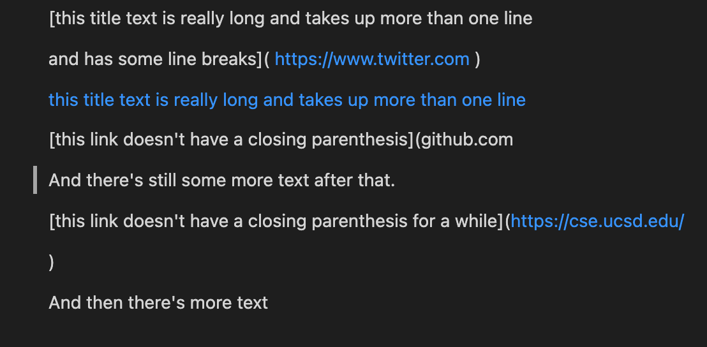
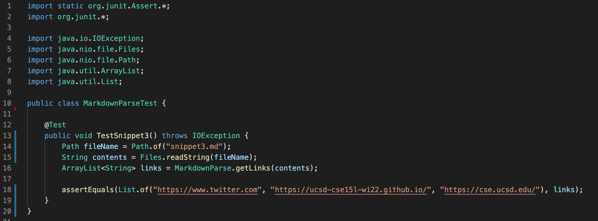

# Week 6 Lab Report 
**Daniel Bronshteyn**
**PID: A16882179**

*Link to my `markdown-parse` repository:* [https://github.com/dbronshteynCS/markdown-parse](https://github.com/dbronshteynCS/markdown-parse)

*Link to `markdown-parse` repository that I reviewed:* [https://github.com/TheZenMasterz/markdown-parse](https://github.com/TheZenMasterz/markdown-parse)

---

## **Snippet 1**

**Snippet 1** should produce 3 links, with the first line not being a link as shown in the preview:



Code in `MarkdownParseTest.java` for **Snippet 1**:




### *My implementation*

### *Implementation reviewed*

---

## **Snippet 2**

**Snippet 2** should produce 3 links, with the attempted ```b.com``` not being a link as shown in the preview:



Code in `MarkdownParseTest.java` for **Snippet 2**:



### *My implementation*

### *Implementation reviewed*

---

## **Snippet 3**

**Snippet 3** should produce only 3 links and text as shown in the preview:



Code in `MarkdownParseTest.java` for **Snippet 3**:



### *My implementation*

### *Implementation reviewed*


