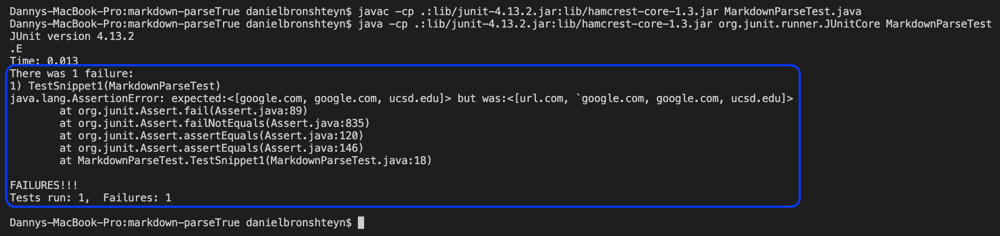
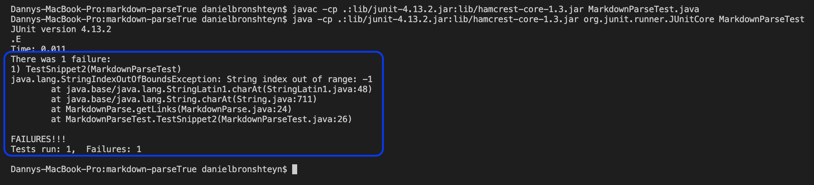

# Week 6 Lab Report 
**Daniel Bronshteyn**
**PID: A16882179**

*Link to my `markdown-parse` repository:* [https://github.com/dbronshteynCS/markdown-parse](https://github.com/dbronshteynCS/markdown-parse)

*Link to `markdown-parse` repository that I reviewed:* [https://github.com/TheZenMasterz/markdown-parse](https://github.com/TheZenMasterz/markdown-parse)

---

## **Snippet 1**

**Snippet 1** should produce 3 links, with the first line not being a link as shown in the preview:


Code in `MarkdownParseTest.java` for **Snippet 1**:


### *My implementation*

Output from running JUnit test:


*The test did not pass. The part circled in blue shows the test failure

### *Implementation reviewed*

Output from running JUnit test:



*The test did not pass. The part circled in blue shows the test failure

---

## **Snippet 2**

**Snippet 2** should produce 3 links, with the attempted ```b.com``` not being a link as shown in the preview:


Code in `MarkdownParseTest.java` for **Snippet 2**:


### *My implementation*

Output from running JUnit test:


*The test did not pass. The part circled in blue shows the test failure

### *Implementation reviewed*

Output from running JUnit test:



*The test did not pass. The part circled in blue shows the test failure

---

## **Snippet 3**

**Snippet 3** should produce only 3 links and text as shown in the preview:


Code in `MarkdownParseTest.java` for **Snippet 3**:


### *My implementation*

Output from running JUnit test:


*The test did not pass. The part circled in blue shows the test failure

### *Implementation reviewed*

Output from running JUnit test:


*The test did not pass. The part circled in blue shows the test failure

---

## **Questions**

### **Question for Snippet 1**

I do believe that there is a small, less than 10 line, code change that will make my program work for Snippet 1 and any related cases that use inline code with backticks. The code change would scan for backticks in the file and ensure that they are disregarded by skipping them. This would ensure that even if backticks exist in the file, the `MarkdownParse.java` would move past them instead of including them in the ArrayList of links made in the getLinks method.

### **Question for Snippet 2**

I do believe that there is a small, less than 10 line, code change that will make my program work for Snippet 2 and all related cases that nest parentheses, brackets, and escaped brackets. The code change that I would implement is that when there is an opening parenthese, bracket, or escaped brackets, anything between the first instance of the opening symbol and the last instance of the closing symbol is included in the ArrayList of links made in the getLinks method. This would ensure that my code produces "a.com(())" instead of "a.com((" in the ArrayList of links. 

### **Question for Snippet 3**

I do not believe that there is a small, less than 10 line, code change that will make my program work for Snippet 3 and all related cases that have newlines in brackets and parentheses. This because checking for new lines is will include more code than code that will move past backticks (my change for Snippet 1) or code that will include anything between the first instance of the opening symbol to the last instance of the closing symbol (my change for Snippet 2). Additionally, there could be multiple new lines which I would have to take into consideration for the code change to make the JUnit test for Snippet 3 pass. 


