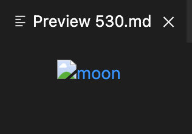
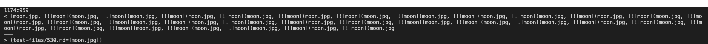
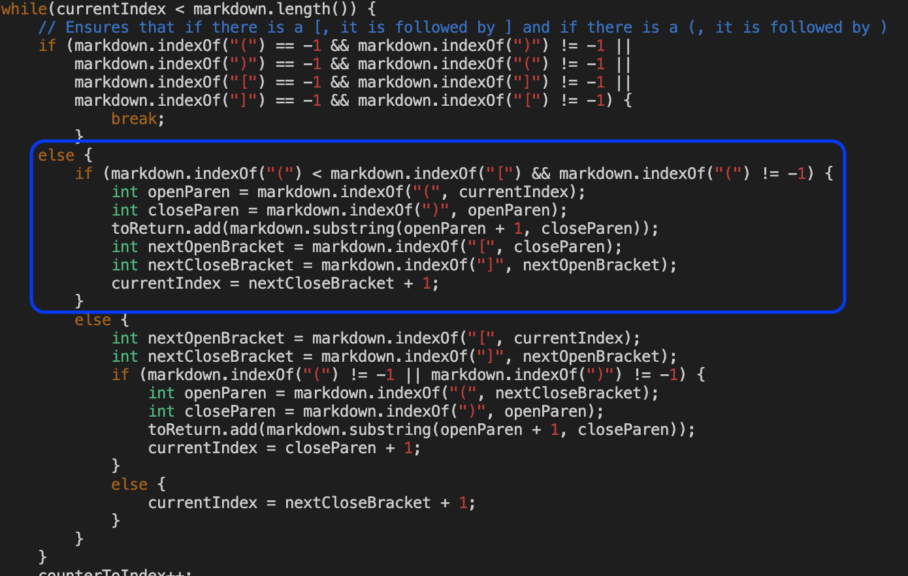
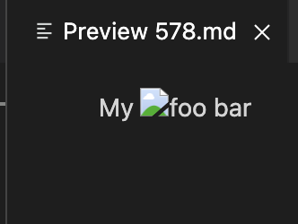
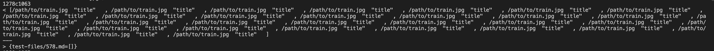
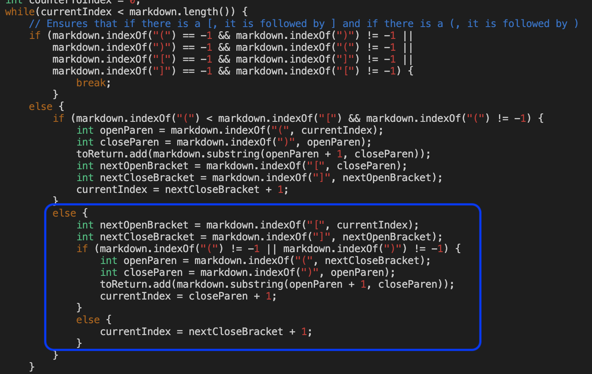

# Week 10 Lab Report 
**Daniel Bronshteyn**
**PID: A16882179**

### The two tests that I chose from the 652 commonmark-spec tests were 530.md and 578.md

---

To find the tests that caused different results between my implementation and the implementation provided in lab, I ran a bash for loop first for my implementation and copied the results into a `results.txt` file that would be stored in the directory holding my implementation. Then I ran a bash for loop on the implementation provided in lab and copied the results into a `results.txt` file that would be stored in the directory holding the implementatation provided in lab. Then I ran the command `diff your-markdown-parse/results.txt Markdown-Parse-Week9/results.txt` with `your-mardown-parse/` directory containing my implementation and `Markdown-Parse-Week9/` directory containing the implementation provided in lab. This command showed me which tests caused different results between the two implementations. 

## Testing 530.md

While my implementation caused the wrong output, the implementation provided in the lab presented the expected output. The expected output is to provide the link `moon.jpg`:

Output when running `diff` and vieweing the file 530.md:

The bug in my implementation that causes the wrong output is that my code does not use the closing parenthese to advance the `currentIndex` variable when it sees that an opening parenthese comes before an opening bracket. Instead it uses the closing bracket to advance the `currentIndex` under this condition; therefore causing the wrong output. This is why the output shows multiple `![moon](moon.jpg,` after properly showing just `moon.jpg` as the `currentIndex` is restarted back at the beginning of the line and copies everything between the opening bracket and closing bracket. 

Image of the code that needs to be fixed:

---

## Testing 578.md

In testing 578.md, my implementation causes the wrong output while the implementation provided in lab 9 presents the expected output. The expected output is an empty list of links because there are no links in 578.md: 

Output when running `diff` and viewing the file 578.md:

The bug in my implementation that causes the wrong output is that anything inside of parentheses will be copied and inserted into the ArrayList that returns the list of links. For 578.md, there is the text "title" inside of the parentheses. This text causes the link `/path/to/train.jpg` to be invalidated as a link by "Preview 578.md". The implementation from the lab also invalidates the link while mine does not. To fix this, my code should look for additional text, and if found, stop itself from adding the link to the list of links to return. 

The code that should be fixed:

