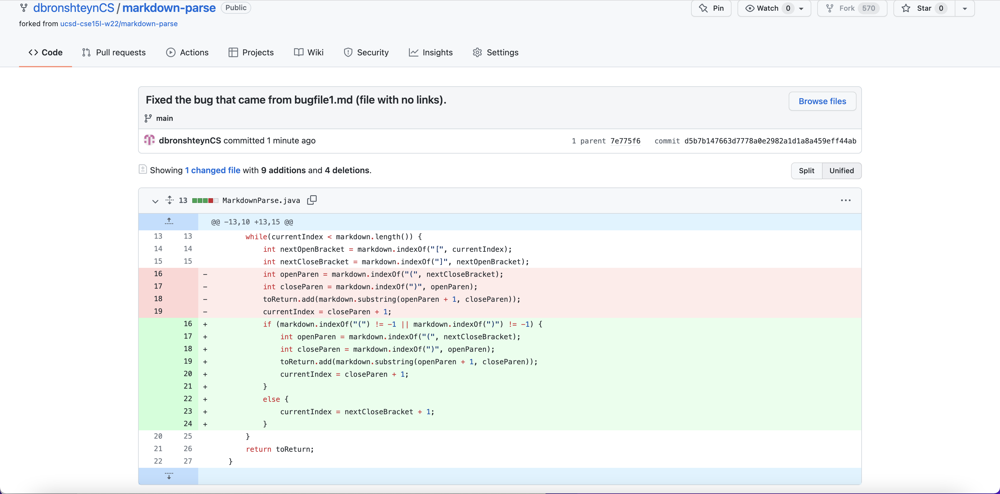
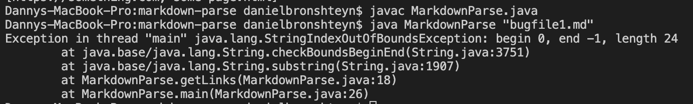
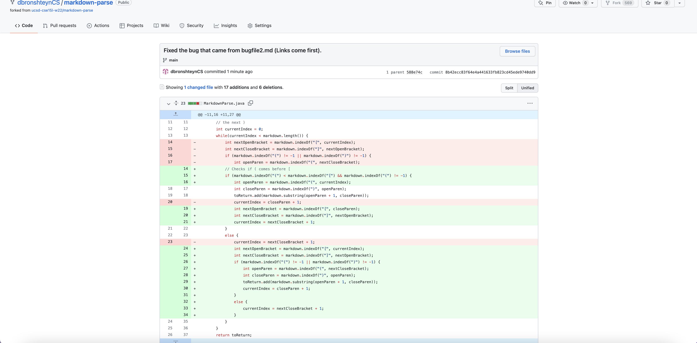
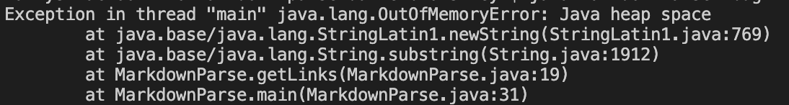
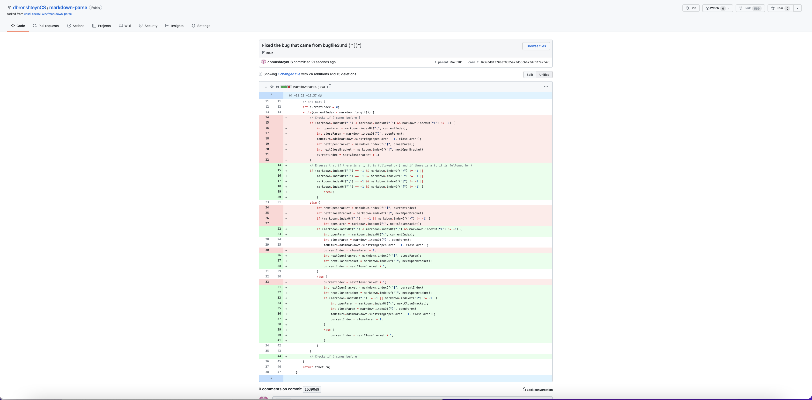
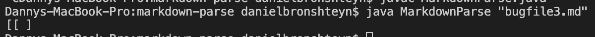

# Week 4 Lab Report 
**Daniel Bronshteyn**
**PID: A16882179**

# *Three code changes to fix a bug*


## First Code Change

>First Code Change Diff


**Link to test file for *failure-inducing input*:** [https://github.com/dbronshteynCS/markdown-parse/blob/main/bugfile1.md](https://github.com/dbronshteynCS/markdown-parse/blob/main/bugfile1.md)

>Symptom of failure-inducing input:


The bug in `MarkdownParse.java` was that it was searching for parentheses "()" so that it could add the String inside the paratheses to the `toReturn` array. This bug caused the following symptom when using the failure-inducing input of `bugfile1.md`:
```
Exception in thread "main" java.lang.StringIndexOutOfBoundsException: begin 0, end -1, length 24
        at java.base/java.lang.String.checkBoundsBeginEnd(String.java:3751)
        at java.base/java.lang.String.substring(String.java:1907)
        at MarkdownParse.getLinks(MarkdownParse.java:18)
        at MarkdownParse.main(MarkdownParse.java:26)
```
As seen in this relationship, the failure-inducing input caused the sympton shown above due to the bug in `MarkdownParse.java`. I fixed the bug by making `MarkdownParse.java` able to continue when there are no links in the input.

---

## Second Code Change

>Second Code Change Diff


**Link to test file for *failure-inducing input*:** [https://github.com/dbronshteynCS/markdown-parse/blob/main/bugfile2.md](https://github.com/dbronshteynCS/markdown-parse/blob/main/bugfile2.md)

>Symptom of failure-inducing input:


The bug in `MarkdownParse.java` was that it was first searching for brackets "[]" before going to the parentheses, copying the string inside the parentheses, and adding the string to the `toReturn` array. This bug caused the following symptm when using the failure-inducing input of `bugfile2.md`:
```
Exception in thread "main" java.lang.OutOfMemoryError: Java heap space
        at java.base/java.lang.StringLatin1.newString(StringLatin1.java:769)
        at java.base/java.lang.String.substring(String.java:1912)
        at MarkdownParse.getLinks(MarkdownParse.java:19)
        at MarkdownParse.main(MarkdownParse.java:31)
```
In this relationship, the failure-inducing input of `bugfile2.md` caused the symptom shown above due to the bug in `MarkdownParse.java`. I fixed the bug by making it so that `MarkdownParse.java` can read a file when parentheses holding the links are provided before the brackets. 

---

## Third Code Change

>Third Code Change Diff


**Link to test file for *failure-inducing input*:** [https://github.com/dbronshteynCS/markdown-parse/blob/main/bugfile3.md](https://github.com/dbronshteynCS/markdown-parse/blob/main/bugfile3.md)

>Symptom of failure-inducing input:


